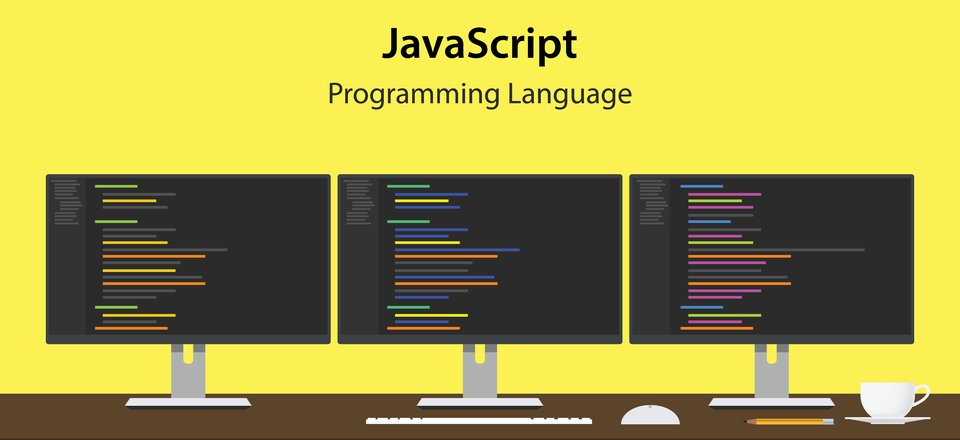

 
 
<h1>
  Bienvenido al Curso de JavaScript
</h1>
 
 
En este repositorio encontrarás todos los documentos utilizados en el curso.  Este curso está basado en la  documentación confiable en línea  y se hace referencia a todos los recursos  empleados en el mismo. Este curso es detallado y pretende abarcar el máximo de conceptos del lenguaje.
 
 
Módulos completados
<ul>
  <li>
    001-Tutorial-de-JavaScript
    <ul>
      <li>
        00001-Introduccion-a-JavaScript
      </li>
      <li>
        00002-JavaScript-a-donde
      </li>
      <li>
        00003-Salida-de-JavaScript
      </li>
      <li>
        00004-Declaraciones-JavaScript
      </li>
      <li>
        00005-Sintaxis-de-JavaScript
      </li>
      <li>
        00006-Comentarios-de-JavaScript
      </li>
      <li>
        00007-Variables-de-JavaScript
      </li>
      <li>
        00008-Operadores-de-JavaScript
      </li>
      <li>
        xxxxxxxxxxxx
      </li>
    </ul>
  </li>
  <li>
    xxxxxxxxxxx
  </li>
</ul>
Referencias
 
https://codefuncode.github.io/Curso-de-JavaScript/
 
https://developer.mozilla.org/en-US/docs/Web/Accessibility
 
https://developer.mozilla.org/en-US/docs/Web/Accessibility/ARIA/Roles/Table_Role
 
https://developer.mozilla.org/en-US/docs/Web/API/WindowOrWorkerGlobalScope/fetch#syntax
 
https://developer.mozilla.org/en-US/docs/Web/API/Fetch_API
 
